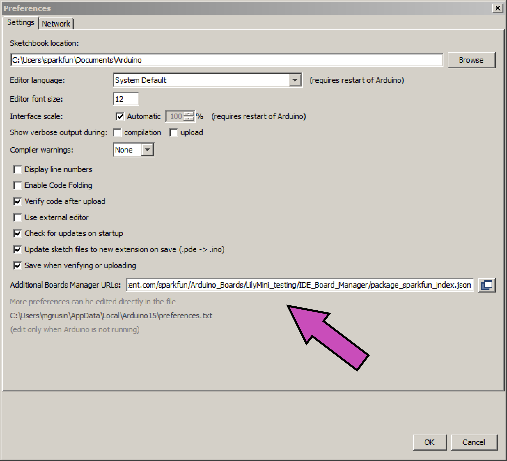
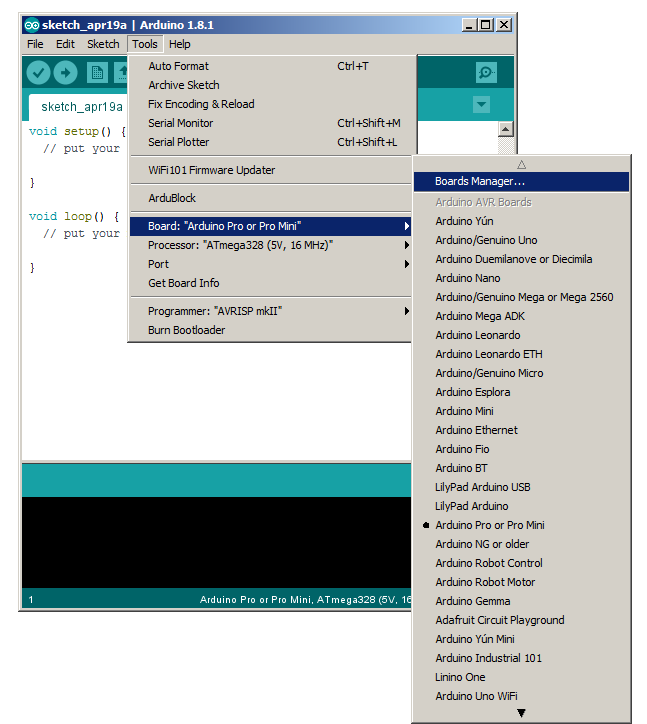
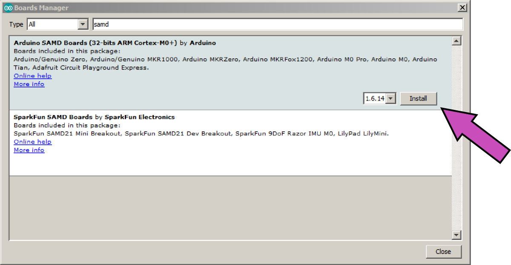
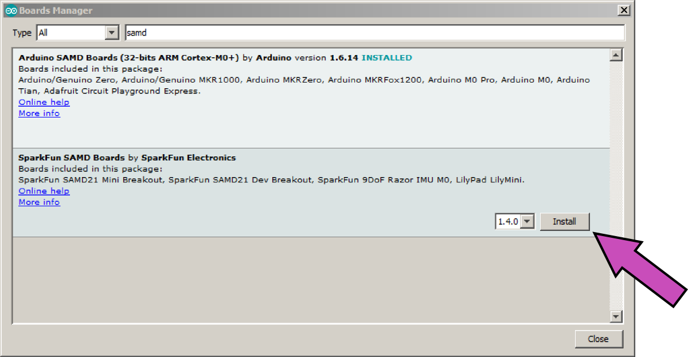

# SparkFun Arduino Boards

This repository contains support for the following SparkFun Arduino-compatible development boards.

**IMPORTANT NOTE:** These board files have been updated for compatibility with Arduino version 1.8 and higher. Some boards (e.g. SAMD) may not compile correctly with earlier versions of Arduino. If you need compatibility with earlier versions of Arduino, you can choose previous releases of these boards from the Boards Manager.

#### Apollo3 Boards
* [Artemis Module](https://www.sparkfun.com/products/15484)
* [Redboard Artemis](https://www.sparkfun.com/products/15444)
* [Redboard Artemis ATP](https://www.sparkfun.com/products/15442)
* [Redboard Artemis Nano](https://www.sparkfun.com/products/15443)
* [Edge]()

#### AVR Boards

* [RedBoard](https://www.sparkfun.com/products/12757)
* [MaKey MaKey](https://www.sparkfun.com/products/11511)
* [Pro Micro 3.3V](https://www.sparkfun.com/products/10999)
* [Pro Micro 5V](https://www.sparkfun.com/products/11098)
* [Fio v3](https://www.sparkfun.com/products/11520)
* [Qduino Mini](https://www.sparkfun.com/products/13614)
* [Digital Sandbox](https://www.sparkfun.com/products/12651)
* [Mega Pro 3.3V](https://www.sparkfun.com/products/10744)
* [Mega Pro 5V](https://www.sparkfun.com/products/11007)
* [RedBot](https://www.sparkfun.com/products/12097)
* [Serial 7-Segment Display](https://www.sparkfun.com/products/11441)
* [ATmega128RFA1 Development Board](https://www.sparkfun.com/products/11197)
* [LilyPad USB Plus](https://www.sparkfun.com/products/14346)

#### SAMD (ARM Cortex-M0+) Boards

* [SparkFun SAMD21 Dev Breakout](https://www.sparkfun.com/products/13672)
* [SparkFun SAMD21 Mini Breakout](https://www.sparkfun.com/products/13664)
* [SparkFun 9DoF Razor IMU M0 (SAMD21)](https://www.sparkfun.com/products/14001)
* [SparkFun LilyMini ProtoSnap (SAMD11)](https://www.sparkfun.com/products/14063)
* [SparkFun LilyMini (SAMD11)](https://www.sparkfun.com/products/14064)
* [SparkFun SAMD21 Pro RF LoRa 915MHz](https://www.sparkfun.com/products/14916)
* [SparkFun Qwiic Micro](https://www.sparkfun.com/products/15423)

#### ESP8266 Boards
_These boards are supported by [Espressif](https://github.com/esp8266/Arduino)_. :+1:
* [ESP8266 Thing](https://www.sparkfun.com/products/13231)
* [ESP8266 Thing Dev](https://www.sparkfun.com/products/13711)  
* [ESP8266 WiFi Shield](https://www.sparkfun.com/products/13287)
* [SparkFun Blynk](https://www.sparkfun.com/products/13794)

#### ESP32 Boards
_These boards are supported by [Espressif](https://github.com/espressif/arduino-esp32/blob/master/docs/arduino-ide/boards_manager.md)._ :+1:
* [SparkFun Thing Plus - ESP32 WROOM](https://www.sparkfun.com/products/14689)
* [SparkFun ESP32 Thing](https://www.sparkfun.com/products/13907)
* [SparkFun LoRa Gateway - 1-Channel (ESP32](https://www.sparkfun.com/products/15006)

### Installation Instructions

To add board support for our products, start Arduino and open the Preferences window (**File** > **Preferences**). Now copy and paste the following URL into the 'Additional Boards Manager URLs' input field:

	https://raw.githubusercontent.com/sparkfun/Arduino_Boards/master/IDE_Board_Manager/package_sparkfun_index.json

If there is already an URL from another manufacturer in that field, click the button at the right end of the field. This will open an editing window allowing you to paste the above URL onto a new line.

### Apollo3 and AVR Installation Instructions

Open the Boards Manager window by selecting **Tools** > **Board**, scroll to the top of the board list, and select **Boards Manager**.

If you type "sparkfun" (without quotes) into the "filter your search" field, you will see options to install SparkFun's Apollo3 and AVR board files. Click in the desired box, and click the "Install" button that appears. Once installed, the boards will appear at the bottom of the board list.

### SAMD Installation Instructions

When installing SAMD boards, you will need to first install Arduino SAMD support, then SparkFun's SAMD boards.

Open the Boards Manager window by selecting **Tools** > **Board**, scroll to the top of the board list, and select **Boards Manager**. Now type "samd" (without quotes) into the "filter your search" field at the top of the window. Two entries should show up, one for Arduino SAMD boards, and one for SparkFun SAMD boards. We'll install both of these, starting with Arduino SAMD boards.

Click anywhere in the "Arduino SAMD Boards" box, and click "Install". This is a large installation and will take a while.

Now click anywhere in the "SparkFun SAMD Boards" box, and click "Install". This is a small installation and will happen much faster.

You're now ready to use SparkFun SAMD boards. They will appear at the bottom of the board list.

### ESP Boards?

All support for our ESP based boards are supported within their respective Espressif's Repository. 

* For our ESP8266 based boards: [Blynk](https://www.sparkfun.com/products/13794), [ESP8266 Thing](https://www.sparkfun.com/products/13231), or [ESP8266 Thing Dev](https://www.sparkfun.com/products/13711), you can install the board files by following the instructions [here](https://github.com/esp8266/Arduino).

* For our ESP32 based boards Boards: [SparkFun Thing Plus - ESP32 WROOM](https://www.sparkfun.com/products/14689), [SparkFun ESP32 Thing](https://www.sparkfun.com/products/13907), [SparkFun LoRa Gateway - 1-Channel (ESP32](https://www.sparkfun.com/products/15006) you can install the board files by following the instructions [here](https://github.com/espressif/arduino-esp32/blob/master/docs/arduino-ide/boards_manager.md).

### Notes

* Some boards such as the Arduino Pro and Pro Mini come in more than one flavor.  For these **you must select the correct processor** in the 'Tools' menu.
* Information on compiling and programming the bootloaders can be found in the bootloaders directory.

**Have fun!** 
\-Your friends at SparkFun
