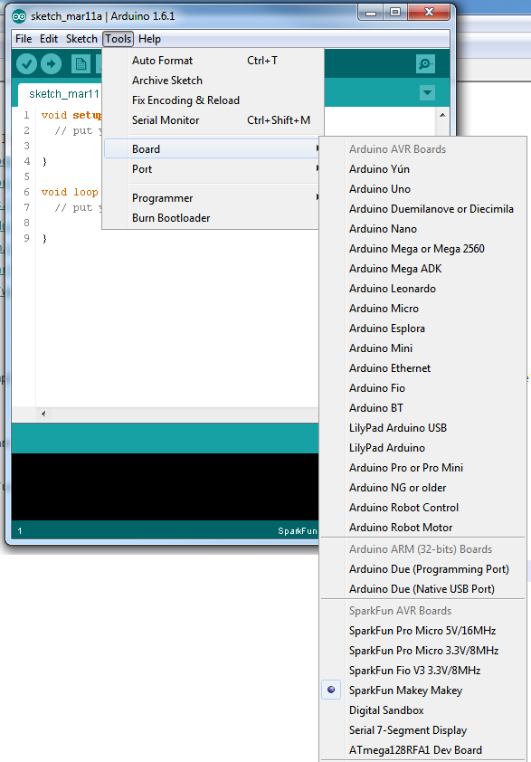
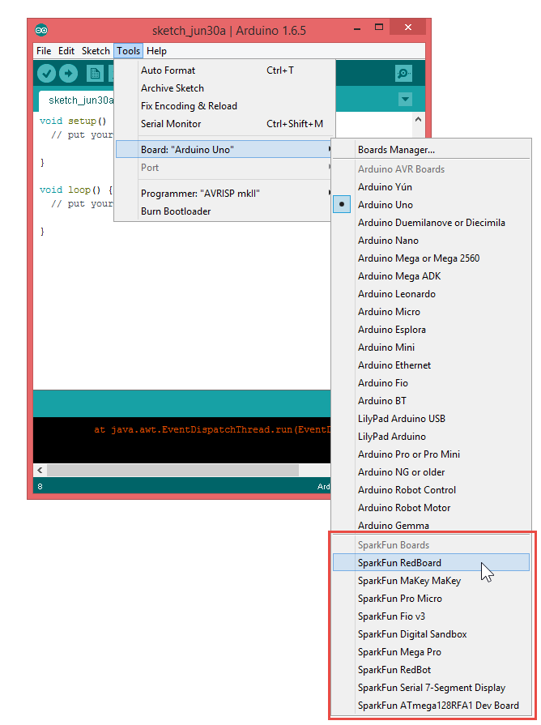

# SparkFun Arduino Boards

This repository contains support for the following SparkFun Arduino-compatible development boards:

#### AVR Boards

* [RedBoard](https://www.sparkfun.com/products/12757)
* [MaKey MaKey](https://www.sparkfun.com/products/11511)
* [Pro Micro 3.3V](https://www.sparkfun.com/products/10999)
* [Pro Micro 5V](https://www.sparkfun.com/products/11098)
* [Fio v3](https://www.sparkfun.com/products/11520)
* [Qduino Mini](https://www.sparkfun.com/products/13614)
* [Digital Sandbox](https://www.sparkfun.com/products/12651)
* [Mega Pro 3.3V](https://www.sparkfun.com/products/10744)
* [Mega Pro 5V](https://www.sparkfun.com/products/11007)
* [RedBot](https://www.sparkfun.com/products/12097)
* [Serial 7-Segment Display](https://www.sparkfun.com/products/11441)
* [ATmega128RFA1 Development Board](https://www.sparkfun.com/products/11197)

#### SAMD (ARM Cortex-M0+) Boards

* [SparkFun SAMD21 Dev Breakout](https://www.sparkfun.com/products/13672)
* [SparkFun SAMD21 Mini Breakout](https://www.sparkfun.com/products/13664)

#### ESP8266 Boards

* [ESP8266 Thing](https://www.sparkfun.com/products/13231)
* [ESP8266 WiFi Shield](https://www.sparkfun.com/products/13287)

Each board will be added as an entry to the Arduino **Tools** > **Board** menu.

### Installation Instructions

To add board support for our products, go to **File** > **Preferences**, and paste this URL into the 'Additional Boards Manager URLs' input field:

	https://raw.githubusercontent.com/sparkfun/Arduino_Boards/master/IDE_Board_Manager/package_sparkfun_index.json

This field can be found in 'Preferences...' under the Arduino File menu.

Now, under the **Tools** > **Board** > **Boards Manager...**, if you type in "sparkfun", you will see an option to install board files for SparkFun Arduino compatible boards. Click "Install" to add these to your list.

**NOTE: If you are using Arduino 1.6.6 and the link isn't working for you, change "https" at the beginning of the link to "http" and try again. We're working to figure out why this is happening in version 1.6.6.**

Now, when you select the Boards list, you will see a collection of new boards for SparkFun.

### Cleaning up the Boards Menu

Each entry in the boards list is defined in [boards.txt](https://github.com/sparkfun/Arduino_Boards/blob/master/sparkfun/avr/boards.txt). If you want to de-clutter the menu, you can comment out a board by inserting a `#` at the beginning of each line.

### Notes

* **Please note: This will only work under Arduino IDE versions 1.5 and up.**
* Some boards such as the Pro Micro and the Mega Pro come in more than one form.  For these **you must select the correct processor** in the 'Tools' menu.
* Information on compiling and programming the bootloaders can be found in the bootloaders directory.
* **Bugs introduced in the Arduino IDE version 1.6.6 through at least 1.6.9 produce errors indicating there is something wrong with these files. This can be resolved by reverting back to 1.6.5-r5. So far all reports seem to indicated that 1.6.10 has also fixed the issues. These intermittent issues are difficult to reliably reproduce.**
